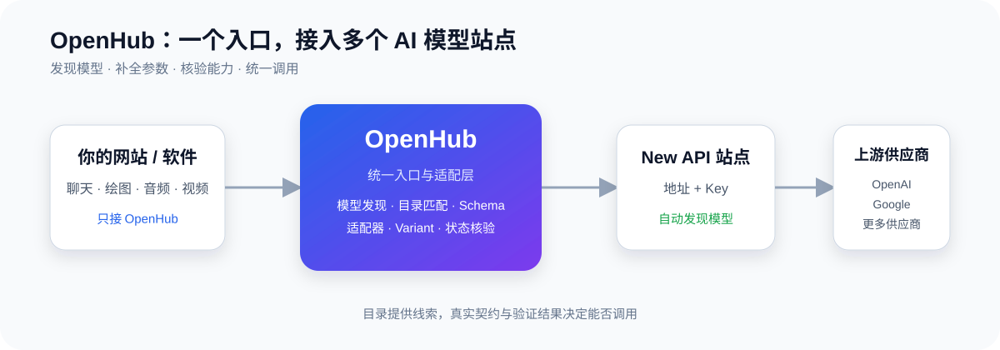

<div align="center">
<small>✨ 赞助商</small>
</div>

<table style="width:100%;border:1px solid #d1d9e0;border-radius:12px;border-collapse:separate;">
  <tr>
    <td align="center" style="padding:0;border:none;">
      <a href="https://api.memefast.cc/" target="_blank">
        
      </a>
    </td>
  </tr>
  <tr>
    <td align="left" style="padding:18px 24px 22px 24px;border:none;background:#ffffff;">
      <a href="https://api.memefast.cc/" target="_blank" style="text-decoration:none;font-size:22px;color:#24292f;font-weight:bold;">Memefast API中转聚合服务</a>
      <br>
      <span style="font-size:16px;color:#57606a;">更多模型，高稳定API通道</span>
      <br>
      <a href="https://api.memefast.cc/" target="_blank" style="font-size:16px;color:#0969da;margin-top:10px;display:inline-block;">🔗 https://api.memefast.cc/</a>
    </td>
  </tr>
</table>

<br>


# OpenHub

> 把分散在不同站点里的 AI 模型，接成一个可识别、可配置、可调用的统一入口。



很多 AI 应用真正难的，不是再写一个聊天窗口，而是接入之后仍然要面对：

- 不同站点的模型名称不统一，同一个模型可能有多种写法。
- LLM、图片、音频、视频的请求参数和返回方式完全不同。
- 视频等媒体任务通常需要创建任务、等待处理、轮询状态、获取结果。
- 更换站点或供应商时，上层网站不应该跟着重写一套调用逻辑。
- 目录里的模型信息只能提供线索，不能直接证明某个站点真的可以调用。

## OpenHub 怎么解决

OpenHub 位于你的应用和多个 New API 站点之间：

```text
你的网站或软件 → OpenHub → 多个 New API 站点 → AI 模型供应商
```

接入一个站点地址和 Key 后，OpenHub 可以：

1. 发现站点实际提供的模型，并按 LLM、Embedding、图片、音频、视频分类。
2. 用模型目录和参数模板补充名称、厂商、能力和常见限制。
3. 对已经具备证据的模型建立适配关系，保留未确认项，不把猜测伪装成可用。
4. 通过适配器处理不同供应商的参数差异、响应格式和异步任务流程。
5. 用稳定的 Variant 名称对外提供调用入口，让上层应用尽量不感知底层站点变化。

## 适合谁

- 正在开发 AI 聊天、绘图、配音或视频生成网站的开发者。
- 同时使用多个 New API 站点，需要统一管理模型的团队。
- 想保留供应商选择权，又不想让业务代码绑定某一家供应商的产品团队。

## 它不是什么

- 不是模型交易市场，也不负责替供应商保证额度、价格或稳定性。
- 不是把所有模型名称自动改成“看起来正确”的目录展示器。
- 不是承诺所有供应商开箱即用；缺少真实契约、参数或适配器时，会明确提示需要补全或验证。

OpenHub 的目标很简单：让模型接入从“每家都单独适配”，变成“站点可发现、能力可核验、参数可复用、调用可统一”。

> 本文后半部分是本地部署、启动和接口验证手册；产品定位与技术边界见仓库根目录 `DESIGN.md`。

---

## 本地部署与验证

当前支持边界、适配器 SDK 和外部接入方式分别见 `docs/MULTIMODAL-PROVIDER-EVIDENCE.md`、`docs/ADAPTER-SDK.md` 和 `docs/MULTIMODAL-INTEGRATION.md`。

---

## 0. 前置要求

- Node.js 22.x（项目根目录 `.node-version` 为事实来源；Node 24 不属于支持范围）
- pnpm `10.4.1`（优先使用 Corepack；项目根目录 `packageManager` 已固定版本）
- 一个可访问的 New API 站点（用于联调）

基线验证命令：

```powershell
pnpm typecheck
pnpm test
pnpm --filter @openhub/web build
```

---

## 1. 安装依赖

```powershell
cd E:\code\openhub
pnpm install
```

预期：`packages/{server,catalog,web}` 三个子包都安装好，无 peer dep 错误。

---

## 2. 初始化数据库

```powershell
cd packages\server
pnpm db:push
```

预期：在 `packages\server\data\openhub.db` 生成 SQLite 文件，包含
`sites / models / keys / variants / model_catalog / model_catalog_alias / catalog_sync_runs` 7 张表。

如需交互式查看数据：

```powershell
pnpm db:studio
```

---

## 3. 配置环境变量

复制示例文件并按需修改：

```powershell
cd packages\server
copy .env.example .env
notepad .env
```

至少确认 `OPENHUB_MASTER_KEY` 已设置为长度 >= 16 的随机字符串。
管理后台账号默认 `admin / admin123`，生产环境请改。

---

## 4. 启动后端

```powershell
cd packages\server
pnpm dev
```

预期日志：

```
[openhub] listening on http://localhost:3000
```

另开一个终端，启动前端：

```powershell
cd E:\code\openhub
pnpm web:dev
```

预期：Vite 启动，访问 http://localhost:5173

---

## 5. 外部应用接入

上层网站或软件只需要 OpenHub 地址和 OpenHub Key，不需要供应商 Key。可直接使用仓库内的 `@openhub/client`，或按 `docs/MULTIMODAL-INTEGRATION.md` 调用稳定 HTTP API。生产网站建议由自有后端保存 Key，浏览器直连只用于开发或受控环境。

模型名称和目录只负责识别建议；没有供应商契约、适配器或有效配置时，OpenHub 会在执行前返回结构化错误，不把“识别到”伪装成“可调用”。

## 6. Phase 1 全链路验证（按 DESIGN 第 17 章）

### 5.1 健康检查

```powershell
curl http://localhost:3000/health
```

预期：`{"status":"ok"}`

### 5.2 创建站点

```powershell
$SITE = curl -s -X POST http://localhost:3000/admin/sites `
  -H "Content-Type: application/json" `
  -u "admin:admin123" `
  -d '{\"name\":\"Test\",\"baseUrl\":\"https://api.openai.com\",\"apiKey\":\"sk-xxx\",\"adapterId\":\"openai\"}'
$SITE_ID = ($SITE | ConvertFrom-Json).data.id
```

预期返回 `{"data":{"id":"...","name":"Test","status":"active"}}`，后台日志显示已自动发现模型并尝试匹配目录。

### 5.3 触发模型发现

```powershell
curl -X POST "http://localhost:3000/admin/sites/$SITE_ID/discover" -u "admin:admin123"
```

### 5.4 创建虚拟 Key

```powershell
$KEY = curl -s -X POST http://localhost:3000/admin/keys `
  -H "Content-Type: application/json" `
  -u "admin:admin123" `
  -d '{\"name\":\"dev\"}'
$HUB_KEY = ($KEY | ConvertFrom-Json).data.key
```

**注意**：明文 key 仅返回一次，保存到 `$HUB_KEY` 后不要关闭终端。

### 5.5 创建变体

先获取模型 id：

```powershell
$MODELS = curl -s "http://localhost:3000/admin/models?site_id=$SITE_ID" -u "admin:admin123"
$MODEL_ID = ($MODELS | ConvertFrom-Json).data[0].id
```

创建变体：

```powershell
curl -X POST http://localhost:3000/admin/variants `
  -H "Content-Type: application/json" `
  -u "admin:admin123" `
  -d "{\"name\":\"gpt-4o\",\"modelId\":\"$MODEL_ID\"}"
```

### 5.6 发起 chat 请求

```powershell
curl -X POST http://localhost:3000/v1/chat/completions `
  -H "Content-Type: application/json" `
  -H "Authorization: Bearer $HUB_KEY" `
  -d '{\"model\":\"gpt-4o\",\"messages\":[{\"role\":\"user\",\"content\":\"1+1=?\"}]}'
```

预期：返回上游模型的 chat completion 响应。

### 5.7 列出模型

```powershell
curl http://localhost:3000/v1/models -H "Authorization: Bearer $HUB_KEY"
```

---

## 7. Phase 2 目录同步验证

### 6.1 触发目录同步

```powershell
curl -X POST http://localhost:3000/admin/catalog/sync -u "admin:admin123"
```

预期（首次同步约 5-10 秒）：

```json
{ "data": { "status": "success", "total": 612, "added": 612, "updated": 0, "removed": 0, "durationMs": 4521 } }
```

### 6.2 查看同步日志

```powershell
curl http://localhost:3000/admin/catalog/runs -u "admin:admin123"
```

### 6.3 查询目录条目

```powershell
curl "http://localhost:3000/admin/catalog?q=gpt-4o" -u "admin:admin123"
```

### 6.4 强制重新匹配

```powershell
curl -X POST http://localhost:3000/admin/catalog/rematch -u "admin:admin123"
```

---

## 8. 常见问题

### 7.1 安装/启动阶段

| 现象 | 原因 | 修复 |
|---|---|---|
| `OPENHUB_MASTER_KEY is not set` | 没设环境变量 | 编辑 `packages\server\.env` |
| `[openhub] schema init failed: Missing tables` | 没跑 `pnpm db:push` | `cd packages\server && pnpm db:push` |
| `pnpm install` 报 peer dep 错误 | Node 版本过低 | 升级到 Node 22+ |
| `Cannot find module '@openhub/catalog'` | workspace 链接未建立 | 删除 `node_modules` 后重新 `pnpm install` |
| `MODULE_NOT_FOUND: better-sqlite3` | native 模块未编译 | `pnpm rebuild better-sqlite3` |
| 端口 3000 占用 | 已有进程占用 | 改 `PORT` 环境变量 |

### 7.2 运行时阶段

| 现象 | 原因 | 修复 |
|---|---|---|
| `/admin/*` 返回 401 | 没传 Basic Auth | curl 加 `-u "admin:admin123"`，UI 走自动 Basic 弹窗 |
| `/v1/*` 返回 401 missing_auth | 缺 `Authorization: Bearer <hub-key>` | 用创建 Key 时返回的明文 |
| `/v1/chat/completions` 返回 404 variant_not_found | 用了模型名（如 `gpt-4o`）而非变体名 | 在管理后台确认 variant name |
| chat 返回 502 upstream_error | 上游 New API 不可达 | 检查站点的 baseUrl + Key，用 `/admin/sites/:id/health` 测试 |
| `Catalog schema validation failed` | models.dev schema 变更 | 等 OpenHub 升级到上游 |
| `Discover models failed: HTTP 401` | 上游站点 API Key 无效 | 在 UI 重新编辑站点更新 Key |
| `fetch failed` on catalog sync | 网络无法访问 models.dev | 配 `MODELS_DEV_URL` 或跳过 Phase 2 |
| 自动匹配率低 | 站点模型名不规范 | 在 UI 用 `/admin/catalog?q=...` 找目录 ID，然后手动建变体 |

### 7.3 前端开发

| 现象 | 修复 |
|---|---|
| 端口 5173 占用 | 改 `packages\web\vite.config.ts` 的 `server.port` |
| 前端请求后端 404 | 确认 vite proxy 配置（已配置 `/v1` `/admin` → `localhost:3000`） |
| TS 类型错 | `pnpm typecheck` 查看完整错误 |

---

## 9. Docker 一键启动（开发联调用）

```powershell
cd E:\code\openhub
copy .env.docker .env       # Windows
docker compose up --build
```

预期：

- 服务监听 `http://localhost:3000`
- 数据卷 `openhub-data` 持久化 SQLite 文件
- 默认管理账号 `admin / admin123`（**生产前必须改**）

---

## 10. 目录结构

```
E:\code\openhub\
├── DESIGN.md                      # 设计文档（只读）
├── README.md                      # 本文件
├── package.json                   # monorepo 根
├── pnpm-workspace.yaml
├── tsconfig.base.json
├── .gitignore
└── packages/
    ├── catalog/                   # 复用上游 + 自研 sync/matcher（独立 workspace 包）
    │   ├── package.json
    │   ├── tsconfig.json
    │   └── src/
    │       ├── index.ts
    │       ├── upstream/
    │       │   ├── index.ts
    │       │   ├── schema.ts      # 直接复用上游 Zod 字段定义（MIT）
    │       │   ├── family.ts      # ModelFamilyValues + inferKimiFamily
    │       │   ├── stable.ts      # 复用上游 stable 函数
    │       │   └── omit.ts        # 复用上游 applyOmit
    │       ├── sync/
    │       │   ├── index.ts
    │       │   ├── perform.ts     # 自研：performSync（依赖注入式）
    │       │   ├── catalog-to-fields.ts
    │       │   └── types.ts
    │       └── matcher/
    │           ├── index.ts
    │           └── match-model.ts # 自研：四步匹配算法
    ├── server/                    # Hono + Drizzle + SQLite
    │   ├── package.json
    │   ├── tsconfig.json
    │   ├── drizzle.config.ts
    │   ├── .env / .env.example
    │   └── src/
    │       ├── index.ts
    │       ├── db/
    │       │   ├── index.ts       # drizzle 实例
    │       │   └── schema/
    │       │       ├── index.ts
    │       │       ├── sites.ts
    │       │       ├── models.ts
    │       │       ├── keys.ts
    │       │       ├── variants.ts
    │       │       └── catalog.ts
    │       ├── lib/
    │       │   ├── crypto.ts      # AES-256-GCM
    │       │   └── token.ts       # Key 生成 + hash
    │       ├── middleware/
    │       │   ├── auth.ts        # Hub 虚拟 Key
    │       │   └── admin-auth.ts  # 管理后台 Basic Auth
    │       ├── engine/
    │       │   ├── index.ts
    │       │   ├── adapter.ts
    │       │   ├── adapters/
    │       │   │   └── openai.ts
    │       │   ├── discover.ts
    │       │   └── catalog/
    │       │       ├── db-adapter.ts
    │       │       └── match-after-discover.ts
    │       └── routes/
    │           ├── api.ts
    │           ├── admin.ts
    │           ├── admin/
    │           │   ├── sites.ts
    │           │   ├── keys.ts
    │           │   ├── variants.ts
    │           │   ├── models.ts
    │           │   └── catalog.ts
    │           ├── v1/
    │           │   ├── models.ts
    │           │   ├── chat.ts
    │           │   └── embeddings.ts
    │           └── router.ts
    └── web/                       # React + Vite 管理后台
        ├── package.json
        ├── tsconfig.json
        ├── vite.config.ts
        ├── index.html
        ├── .env
        └── src/
            ├── main.tsx
            ├── App.tsx
            ├── index.css
            ├── lib/
            │   └── api.ts
            └── pages/
                ├── Sites.tsx
                ├── Models.tsx
                ├── Keys.tsx
                ├── Variants.tsx
                └── Catalog.tsx
```

---

## 11. 当前下一步

当前重点不是继续堆叠目录或供应商分支，而是为每个新增适配器补齐协议证据、Schema/参数契约、fixture、任务状态映射和合规测试。P0 视频异步任务只保证逐任务查询；batch/dynamic 查询必须有真实协议和专用实现后再启用。

每个新功能都应先在 DESIGN 文档中确认数据模型，再写代码。
